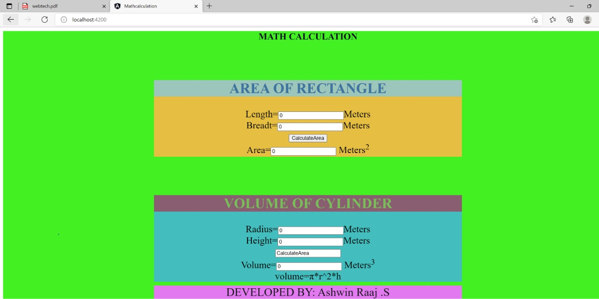
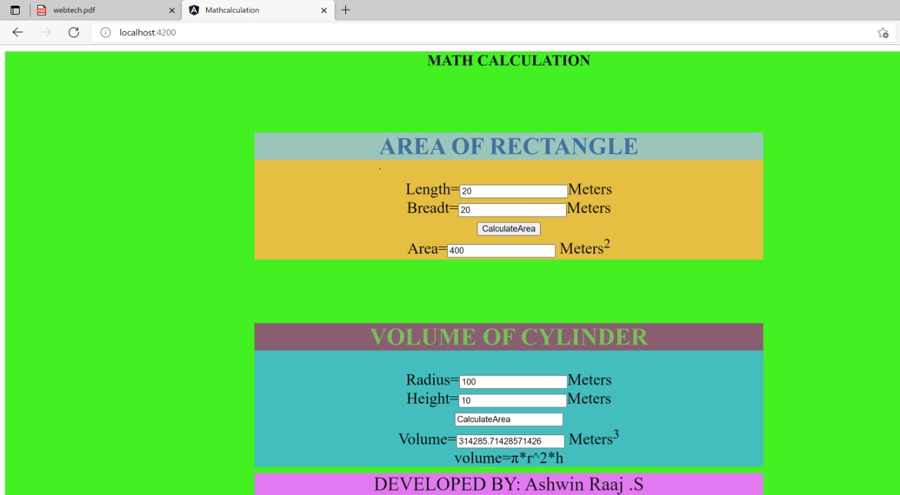

# AngularCalculation

# Web Page for Mathematical Calculations using Angular

## AIM:
To design a dynamic website to perform mathematical calculations using Angular Framwork

## DESIGN STEPS:

### Step 1:

Requirement collection.

### Step 2:

Creating the layout using HTML and CSS in component.html file

### Step 3:

Write typescript to perform the calculations.

### Step 4:

Validate the layout in various browsers.

### Step 5:

Validate the HTML code.

### Step 6:

Publish the website in the given URL.

## PROGRAM :

## OUTPUT:
# rectangle.component.html
```
<style>
    h2{
background-color: rgb(226, 245, 245);
color: rgb(241, 77, 211);
}
.container {
  display: block;
  background-color: #94d7f1;
  min-height: 200px;
  margin-top: 100px;
}
.al{
    text-align: center;
    font-size: 25px;
}

</style>

<div class="container">
    <div class="al">
    <h2>AREA OF RECTANGLE</h2>
    Length=<input type="text"[(ngModel)]='length'>Meters<br/>
    Breadt=<input type="text"[(ngModel)]='breadth'>Meters<br/>
    <input type="button" (click)="onCalculate()" value="CalculateArea"><br/>
    Area=<input type="text" [value]="area"> Meters<sup>2</sup><br/>
</div>

</div>
```
# rectangle.component.ts
```
import { Component } from "@angular/core";

@Component({
    selector:'Rectangle-Area',
    templateUrl:'./rectangle.component.html'
})
export class RectangleComponent{
    length:number;
    breadth:number;
    area:number;
    constructor(){
        this.length=0;
        this.breadth=0;
        this.area=0;


    }
    onCalculate()
    {
            this.area = this.length*this.breadth
    }
}
```
# cylinder.component.html
```
<style>
    h2{
background-color: rgb(228, 245, 245);
color: rgb(241, 77, 211);
}
.container {
  display: block;
  background-color: #bae591;
  min-height: 200px;
  margin-top: 100px;
}
.al{
    text-align: center;
    font-size: 25px;
}

</style>
<div class="container">
<div class="al">
    <h2>VOLUME OF CYLINDER</h2>
    Radius=<input type="text"[(ngModel)]='radius'>Meters<br/>
    Height=<input type="text"[(ngModel)]='height'>Meters<br/>
    <input tAype="button" (click)="onCalculate()" value="CalculateArea"><br/>
    Volume=<input type="text" [value]="volume"> Meters<sup>3</sup><br/>
    volume=π*r^2*h

</div>
</div>
```
# cylinder.component.ts
```
import { Component } from "@angular/core";

@Component({
    selector:'Cylinder-Vol',
    templateUrl:'./cylinder.component.html'
})
export class CylinderComponent{
    radius:number;
    height:number;
    volume:number;
    constructor(){
        this.radius=0;
        this.height=0;
        this.volume=0;
    }
    onCalculate(){
        this.volume = 22/7*this.radius**2*this.height
    }
}
```
# app.component.html
```
<div class="backgd">
  <h2>MATH CALCULATION</h2>
  <div class="container">
      
<Rectangle-Area>

</Rectangle-Area>

<Cylinder-Vol>

</Cylinder-Vol>

<div class="footer">DEVELOPED BY: Ashwin Raaj .S</div>

  </div>

</div>

```
# app.component.css
```
h2{
    text-align: center;
    color: rgb(17, 14, 39);
    margin-top: 10px;


}
.container {
    width: 800px;
    margin-left: auto;
    margin-right: auto;
  }
  .backgd{
    background-color: rgb(67, 240, 33) ;
}
  .footer{
      text-align: center;
      font-size: 30px;
      color: rgb(15, 20, 17);
      background-color: rgb(227, 121, 241);
      margin-top: 10px;
  }
  ```
# app.module.ts
```
import { NgModule } from '@angular/core';
import { FormsModule } from '@angular/forms';
import { BrowserModule } from '@angular/platform-browser';

import { AppComponent } from './app.component';
import { CylinderComponent } from './cylinder/cylinder.component';
import { RectangleComponent } from './rectangle/rectangle.component';

@NgModule({
  declarations: [
    AppComponent,RectangleComponent,CylinderComponent
  ],
  imports: [
    BrowserModule,FormsModule
  ],
  providers: [],
  bootstrap: [AppComponent]
})
export class AppModule { }
```
# app.component.ts
```

@Component({
  selector: 'app-root',
  templateUrl: './app.component.html',
  styleUrls: ['./app.component.css']
})
export class AppComponent {
  title = 'mathcalculation';
}
```

### Output without input:

### Output with input:



## Result:
Thus we have successfully designed the dynamic website to perform mathematical calculations using Angular Framework.
